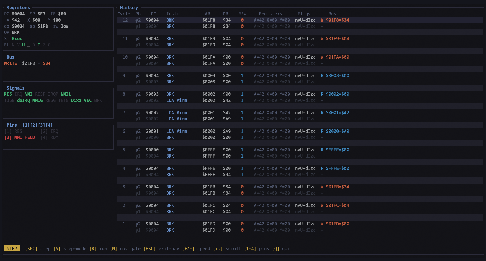

# mos65x
A cycle-accurate emulation backend for MOS 65xx processor-based systems.

## Features

- **Cycle-accurate execution**: models the 6502's phi1/phi2 clock phases, RDY pin stretching, and reset/interrupt sequencing at the hardware level
- **Microcode-driven pipeline**: instructions are defined as sequences of micro-ops with explicit bus operations and internal operation closures
- **Interrupt-handling quirks**: implements all documented interrupt handling quirks like NMI hijacking, RES hijacking, lost nmi, IRQ delay, etc.
- **Flexible device ownership model**: `Bus<H>` is generic over a `DeviceHandle` implementation, supporting `Rc<RefCell<>>`, `Arc<Mutex<>>`, and `Box<>` ownership models
- **DMA controller support** — `DMAController` trait with RDY-based bus arbitration between CPU and DMA masters
- **NMOS 6502 & Ricoh 2a03** — full implementation including unofficial/illegal opcodes and decimal mode behaviour

## Quick Start

```rust
use mos65x::generic_system::RcSystem;
use mos65x::core::variants::NMOS_6502;

fn main() {
let mut system = RcSystem::new(NMOS_6502);

// Attach 64KB RAM
system.attach_ram(0x0000, 0x10000, 1);

// Write a small program
system.bus.write_raw(0x0000, 0xA9); // LDA #$42
system.bus.write_raw(0x0001, 0x42);
system.bus.write_raw(0x0002, 0x00); // BRK

// Tick the system — one tick = one phi1 + phi2
for _ in 0..10 {
system.tick();
}

println!("A = ${:02X}", system.cpu.core.a);
}
```

## Variants
The library supports multiple 65xx variants via a pluggable decoder + quirks system:

| Name | Description |
|------|-------------|
| `NMOS_6502_FULL` | All documented and illegal opcodes as listed by Visual6502 Wiki & ProcessorTests. |
| `NMOS_6502` | Illegal opcodes result in either NOPs or JAMs. Lighter decoding load. |
| `RICOH_2A03` | Customised version of 6502 used by NES, which doesn't include decimal mode. Extends NMOS_6502_FULL. |

Planned:
- 65C02
- Rockwell 65C02
- 65C816 (emulation mode)
- 65C816 [Major architectural additions required to handle 16-bit mode]

## System Types

Choose a system type based on ownership and threading requirements.
Three pre-built system type aliases are provided:

| Type | Handle | DMA | Thread-safe |
|------|--------|-----|-------------|
| `RcSystem<V>` | `Rc<RefCell<>>` | ✓ | ✗ |
| `ArcSystem<V>` | `Arc<Mutex<>>` | ✓ | ✓ |
| `BoxSystem<V>` | `Box<>` | ✗ | — |

`BoxSystem` provides exclusive device ownership. `attach_dma` is unavailable at compile time for `BoxSystem` since `Box` cannot be shared between the bus and the DMA handle.

## Debug Driver
Debug Driver can used on any system which implements the `SystemInterface` trait. 

Displays register state and interrupt signals at cycle and phase granularity. 
All input pins NMI, IRQ, RES and RDY can be held manually through the debug interface. The driver internally sends these signals using the `EmulatorControl` device, which requires shared ownership to work, hence the System's device handle implementation must be compatible.

```rust
    let mut driver = DebugDriver::new(system);
    let _ = driver.run();
```



`BasicDriver` can be used for headless execution.
```rust
let mut driver = BasicDriver::new(system);

// Drive system for n cycles
driver.run_cycles(100);

// Drive system until a JAM is reached
driver.execute();

// Execute with cycle counting at n MHz speed.
driver.timed_execute(5);
```

## Built-in Devices

1. `MemoryDevice`
```rust
let ram = MemoryDevice::ram(size); // size must be a power of two

let bin = vec!([0x8, 0x20, 0x40, 0xEE]);
let rom = MemoryDevice::rom(bin);
```

2. `EmulatorControl`

External control for holding down all CPU pins: NMI, IRQ, RES and RDY.
```rust
let ctrl = EmulatorControl::new();

// hold down nmi pin
// collected by bus open drain through bus.tick()
ctrl.nmi_line = false;
```

## Attaching Devices

Devices are mapped into the system address space via bitmasks. GenericSystem abstracts this with more user-friendly size, base_addr, and mirrors arguments.

```rust
// Attach RAM
system.attach_ram(0x0000, 0x8000, 1);

// Attach ROM
system.attach_rom(rom_bytes, 0x8000, 0x8000, 1);

// Attach a custom device — returns a concrete handle for direct access
let ppu_handle = system.attach_device(PPU::new(), 0x2000, 0x2000, 1);

// Attach a DMA controller
system.attach_dma(OamDMA::new(), 0x4014, 0x1);
```

## Implementing a Device

```rust
use mos65x::core::bus::{Device, Word, Byte};

pub struct MyDevice {
    ram: [u8; 2048],
}

impl Device for MyDevice {
    fn read(&mut self, addr: Word) -> Byte {
        self.ram[addr as usize % 2048]
    }

    fn write(&mut self, addr: Word, val: Byte) {
        self.ram[addr as usize % 2048] = val;
    }

    fn tick(&mut self) {
        // called once per CPU cycle
    }
}
```

## Implementing a DMA Controller

```rust
use mos65x::core::bus::{DMAController, BusMaster};

impl DMAController for OamDMA {
    fn wants_bus(&self) -> bool {
        self.active
    }

    fn dma_tick(&mut self, bus: &mut dyn BusMaster) {
        // Called when CPU is frozen (RDY low) and this controller owns the bus
        if self.cycle % 2 == 0 {
            self.latch = bus.read(self.src_addr);
        } else {
            bus.write(self.dst_addr, self.latch);
            self.src_addr += 1;
            self.dst_addr += 1;
        }
        self.cycle += 1;
        if self.cycle >= 512 {
            self.active = false;
        }
    }
}
```

## Clock Interface

The system exposes the raw φ1/φ2 clock phases for cycle-exact control:

```rust
// Full cycle
system.tick();

// Or manual phase control

// Phase 1
system.cpu.phi1();

// Phase 2
system.bus.tick();         // drive devices
system.cpu.phi2(&mut system.bus);
```

This phase-driven sequence is sufficient for correct functional behavior.

For more accurate modeling of open-drain interrupt lines, an additional interrupt polling step may be introduced during φ1:

```rust
// Phase 1
system.cpu.phi1();
system.bus.poll_interrupts();

// Phase 2
system.bus.tick();
system.cpu.phi2(&mut system.bus);
```

This allows cpu pins to be sampled without advancing device state (`device.tick()`).

However, since the 6502 does not synchronize external interrupt pins during φ1, this additional step does not affect observable CPU behavior and is only relevant for bus state accuracy during phi1.

## Testing

The library is validated against the [ProcessorTests](https://github.com/TomHarte/ProcessorTests) single-step test suite, [Klaus Functional Tests](https://github.com/Klaus2m5/6502_65C02_functional_tests), and interrupt servicing quirks tests derived from Visual6502 traces.

```sh
cargo test --test singlestep --features test-utils
cargo test --test klaus_function 
cargo test --test interrupt_servicing 
```

Individual opcode test files can be excluded via the `exclude` list in `singlestep.rs` — used to skip illegal opcodes not supported by the target variant.

## Feature Flags

| Feature | Description |
|---------|-------------|
| `driver` | Enables the TUI debug driver with step/run modes and cycle history |
| `handles` | Enables the generic device handle types (SharedDevice, SyncDevice, OwnedDevice) |
| `devices` | Enables basic device implementations like MemoryDevice and EmulatorControl |
| `generic_system` | Generic System implementation which supports Variant and DeviceHandle parameters |
| `test-utils` | Exposes internal types for integration testing |
